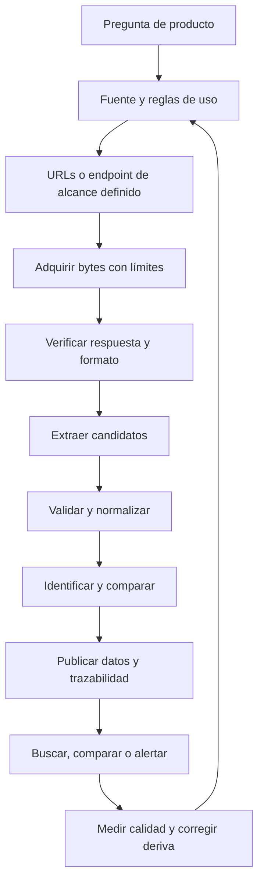

# Cómo funciona un scraper bien construido

## Tres conceptos relacionados

**Scraping:** extraer información estructurada de una representación pensada principalmente para ser leída, por ejemplo el HTML de una oferta. **Crawling:** descubrir y recorrer documentos/enlaces de acuerdo con reglas. **Ingesta por API:** consumir una interfaz de datos explícita. Un sistema puede combinar las tres cosas, pero cada una tiene fallos distintos.

Ejemplo: descargar `/jobs`, encontrar enlaces a detalles, leer cada HTML y guardar título/empresa implica crawling y scraping. Pedir un endpoint que devuelve una lista JSON es ingesta. Leer HTML desde disco permite estudiar el parser, aunque no practique red.

## Pipeline completo



Un script que encuentra un título una vez resuelve una parte. Un recolector útil también sabe cuándo falló, qué dejó fuera, cuánto pidió y si está comparando el mismo aviso.

## 1. Formular la pregunta antes de elegir herramientas

“Quiero todos los trabajos de Internet” no fija un cierre. “Quiero revisar nuevas ofertas Python remotas de una fuente elegida” sí permite definir campos, frecuencia, consulta y límites. El valor no aumenta automáticamente con la cantidad de páginas.

Elegir la fuente según pertinencia, estabilidad de IDs, datos necesarios, formato, frecuencia de actualización y reglas de uso. Preferir interfaces documentadas cuando cumplan el objetivo. Si hay que estudiar HTML, una página propia permite aislar el aprendizaje sin inventar permisos sobre otra web.

## 2. Adquirir la representación correcta

HTTP entrega bytes y metadatos. Hay que verificar estado, contenido-type, encoding y tamaño. A veces una página responde 200 y muestra un error o un desafío. Otras veces el HTML contiene solo el esqueleto de una aplicación: las ofertas aparecen después de JavaScript.

Antes de agregar navegador, inspeccionar qué datos están presentes en el documento y si existe una API pública admitida. Beautiful Soup parsea HTML; no ejecuta JavaScript. Un navegador automatizado agrega renderizado, estado y esperas, junto con costo operativo. [Beautiful Soup](https://www.crummy.com/software/BeautifulSoup/bs4/doc/) y [Playwright](https://playwright.dev/python/docs/intro).

## 3. Extraer por estructura, no por apariencia

Fixture ilustrativa original, no una página externa:

```html
<main data-page="jobs">
  <article class="job" data-id="demo-01">
    <h2><a href="/jobs/demo-01">Python Developer</a></h2>
    <p class="company">Empresa Ejemplo</p>
    <p class="location">Remoto — LATAM</p>
  </article>
</main>
```

La extracción encuentra primero `main[data-page="jobs"]`, luego tarjetas `article.job` y finalmente campos dentro de cada tarjeta. Un selector de título ejecutado globalmente puede mezclar el título de una oferta con la empresa de otra si se procesan listas paralelas.

`data-id` identifica; el texto de `h2 a` titula; `href` se resuelve contra una URL base conocida. `nth-child(3)` depende de posición: agregar un banner puede romperlo. Un selector semántico suele tolerar mejor cambios, pero ninguna clase CSS es un contrato eterno.

Validar la firma de página antes de interpretar cero tarjetas. Una página con contenedor válido y estado explícito “sin ofertas” es distinta de una página que ya no usa el layout conocido.

## 4. Normalizar sin inventar

Transformar entidades y espacios puede mejorar consistencia. Convertir “USD 80k–100k” a un número anual exige información adicional sobre moneda, escala y periodo; si falta, conservar texto. “Remoto en USA” no se normaliza a “desde cualquier lugar”.

Un dato puede ser válido y estar incompleto. Diferenciar campo obligatorio inválido, opcional ausente y valor desconocido. Cada transformación debería poder explicarse a partir de la entrada. Si el algoritmo agrega una inferencia, guardarla aparte con evidencia.

## 5. Identidad y deduplicación

Dos páginas pueden hablar de la misma vacante; dos vacantes pueden tener el mismo título. Un ID estable por fuente resuelve el primer nivel. Una huella de contenido detecta cambios, pero no reemplaza la identidad: si cambió el título, sigue siendo el mismo ID.

Deduplicar entre proveedores es un problema más difícil. Requiere reglas, confianza y revisión de falsos positivos. Para nicrawl conviene tolerar dos representaciones antes que fusionar puestos distintos sin evidencia.

## 6. Paginación y cobertura

Una lista puede usar página numérica, cursor, enlace `next` o scroll infinito. Hay que conocer la condición de fin y llevar registro de qué se visitó. Encontrar un cursor repetido significa posible loop, no permiso para seguir indefinidamente.

Si falla la página 3 de 4, se observaron algunos datos, pero no se conoce el conjunto completo. No se puede usar esa corrida para concluir que desaparecieron ofertas. Los topes de páginas, bytes y registros protegen recursos; alcanzar un tope antes del fin implica cobertura incompleta.

## 7. Persistencia y publicación

Adquirir y validar antes de una transacción corta evita retener bloqueos mientras la red tarda. Publicar ofertas, cambios y resumen juntos evita que una mitad de la corrida sea visible como si estuviera terminada. Conservar procedencia permite volver al origen y depurar el mapper.

Los tiempos responden preguntas distintas: publicación declarada, primera observación, última observación y último cambio material. Una fecha sin zona no se convierte en instante global por agregarle una `Z` arbitraria.

## 8. Operar durante semanas

Las webs cambian. Medir cantidades, rechazos, campos vacíos y errores por origen ayuda a detectar deriva. Una caída repentina a cero suele merecer inspección, aunque el proceso termine con código 0.

El mantenimiento típico consiste en capturar un ejemplo permitido, reproducir el fallo, cambiar el adaptador y verificar que otras variantes siguen funcionando. Descargar más rápido no repara un selector equivocado. Los límites y cooldown deben sobrevivir al reinicio del script.

## Qué hace “bueno” al scraper

Produce datos explicables, preserva faltantes, se detiene al perder confianza en la estructura, repite sin duplicar, respeta su presupuesto, conserva el último estado útil y permite reproducir errores. Esa calidad es la base de alertas, buscadores, comparadores y análisis confiables.

En nicrawl: I1 practica extracción; I2 adquisición y persistencia; I3 convierte la colección en una herramienta; I4 amplía descubrimiento y formatos. El recorrido completo está en [ROADMAP](../docs/ROADMAP.md).
