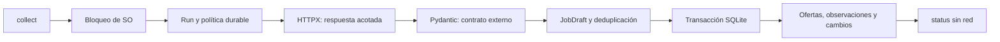

# I2 — de una respuesta real a una colección persistida

Implementado el 2026-09-25. Aplicación **0.2.0**. El objetivo de este corte es estudiar adquisición, validación, identidad y transacciones; esta página conserva el recorrido de I2. Las búsquedas y exportaciones ya están implementadas en [I3](10-local-search-export.md).

## Probar lo que ya está instalado

```powershell
Set-Location C:\Bruze\nicrawl
.\.venv\Scripts\nicrawl.exe status --source remotive
.\.venv\Scripts\nicrawl.exe collect --source remotive
```

`status` lee la base sin red. `collect` consulta la categoría `software-dev` solo si su política lo permite. La primera consulta de verificación guardó **19 ofertas reales**, con un HTTP 200 y cero rechazos. El número es una observación de esa corrida, no un tamaño fijo del proveedor.

La base de esta instalación es `data/nicrawl.sqlite3`. El primer intento ocurrió a las **2026-09-25 21:11:08 UTC**; la siguiente oportunidad inicial quedó a las **2026-09-26 09:11:08 UTC**. El estado actual de la base tiene prioridad sobre estas fechas históricas.

Repetir `collect` antes del momento permitido devuelve **4**, sin hacer otra request. La segunda invocación de verificación confirmó precisamente eso. No borrar o cambiar de base para saltar la cuota. Las bases independientes no comparten automáticamente su historial de acceso; usar siempre la misma para Remotive real.

`--db` es una opción global: `.\.venv\Scripts\nicrawl.exe --db C:\ruta\coleccion.sqlite3 status`. Una ruta relativa se resuelve contra el directorio actual y se muestra como absoluta. El comando de lectura no crea una base faltante.

## Seguir el recorrido real



| Paso | Archivo y función | Pregunta para el debugger |
| --- | --- | --- |
| Argumentos y presentación | [cli.py](../src/nicrawl/cli.py): `collect_command`, `status` | ¿Qué base se eligió? |
| Coordinación | [collection.py](../src/nicrawl/collection.py): `collect` | ¿Qué estado final tendrá el run? |
| Exclusión entre procesos | [locking.py](../src/nicrawl/locking.py): `collection_lock` | ¿Qué pasa si otro proceso ya recolecta? |
| Política durable | [storage.py](../src/nicrawl/storage.py): `gate`, `reserve_attempt` | ¿El intento ya quedó guardado antes de enviar? |
| Adquisición | [acquisition.py](../src/nicrawl/acquisition.py): `fetch` | ¿Quién decide retry, redirect o defer? |
| Contrato externo | [remotive.py](../src/nicrawl/sources/remotive.py): `Envelope`, `RemoteJob`, `parse_response` | ¿Falla la página completa o un registro? |
| Dominio | [domain.py](../src/nicrawl/domain.py): `normalize_job`, `content_hash` | ¿Qué es material y qué es metadato? |
| Publicación | [storage.py](../src/nicrawl/storage.py): `publish` | ¿Qué cambios SQL se confirman juntos? |

No hay framework de DI: reloj y transporte se pasan por parámetros en las pruebas. HTTPX `MockTransport` sustituye la red sin cambiar el parser o el repositorio.

## Modelo externo frente al dominio

Pydantic valida de forma estricta la envoltura y cada DTO. Un `job-count` distinto de la longitud real de `jobs` invalida la colección. Un título vacío invalida ese registro; otros registros válidos pueden publicarse como resultado parcial.

La descripción HTML se convierte a texto y se eliminan scripts/estilos. El salario se conserva como texto; la localización no se convierte en elegibilidad. Una fecha sin offset se guarda como `published_raw`, con `published_at` desconocido. Una fecha con offset puede convertirse a UTC.

Para cada ID repetido: contenido material igual se colapsa; contenido diferente rechaza todos los candidatos de ese ID. Si un candidato de un ID es inválido, también se excluyen sus otras apariciones: no se elige una versión arbitraria para salvarlo.

## Leer SQLite como ejercicio

Ejecutar este fragmento desde un intérprete del entorno, con directorio actual `C:\Bruze\nicrawl`. Solo lee las primeras cinco ofertas; no hace red:

```python
import json
import sqlite3
from contextlib import closing

with closing(sqlite3.connect("file:data/nicrawl.sqlite3?mode=ro", uri=True)) as connection:
    records = connection.execute(
        "SELECT job_key, payload, source_url, last_seen_at FROM jobs ORDER BY job_key LIMIT 5"
    ).fetchall()
    for key, payload, source_url, last_seen in records:
        print(key, json.loads(payload)["title"], last_seen)
        print("Fuente: Remotive —", source_url)
```

Localizar después `runs`, `run_items`, `changes`, `attempts`, `source_state` y `schema_migrations`. El payload es JSON normalizado, no el cuerpo original del API. Las fechas de observación son columnas distintas de las fechas declaradas por el proveedor.

## Tres laboratorios de I2

**Idempotencia.** Leer `test_full_history_idempotence_change_absence_and_offline_status` en [test_collection.py](../tests/test_collection.py). Predecir altas, cambios y observaciones después de cada corrida. Cambiar solo `publication_date`: la prueba de metadatos de [test_i2_edges.py](../tests/test_i2_edges.py) muestra por qué no produce un evento material.

**Rollback.** La prueba `test_sql_failure_rolls_back_all_changes` provoca un error con un trigger sobre la segunda oferta. La primera actualización también debe revertirse. Explicar por qué el intento de red y el run sí quedan como evidencia, pero las ofertas publicadas anteriormente permanecen intactas.

**Crash real.** `test_second_process_cannot_collect_and_crash_releases_lock` crea un proceso hijo, verifica exclusión y lo hace salir abruptamente. El siguiente proceso puede tomar el bloqueo y marcar la corrida anterior como interrumpida. Su intento previo no desaparece de la cuota.

Ejecutar una selección sin Internet:

```powershell
.\.venv\Scripts\python.exe -m pytest tests/test_collection.py tests/test_i2_edges.py
```

Los tests bloquean sockets y usan reloj falso para simular horas sin esperar ni consultar el proveedor. No uses el API real para practicar retries o benchmarks.

## Qué significa el estado

`succeeded`: lote válido publicado, incluso vacío si el contrato lo permite. `partial`: válidos publicados y rechazos registrados. `failed`: ningún dato del lote publicado. `deferred`: política impidió seguir, con código 4. `interrupted`: ejecución cancelada o recuperada tras crash.

`status` separa el último intento (`run`) de la última publicación (`last_published_run`). Un intento diferido no vuelve obsoleta ni borra la colección anterior. Una ausencia nunca etiqueta una vacante como cerrada.

## Límites actuales

Una sola fuente y categoría; políticas fijas en código, sin `--force` ni scheduler. `--db` no es una forma de rotar cuotas. Una fuente detenida por 401/403/desafío requiere diagnóstico y una intervención explícita; no existe botón de desbloqueo automático.

Retención/purga automática, logs rotados, búsqueda, detalle y exportación son trabajo posterior. I2 conserva historial local y muestra diagnóstico desde SQLite. El presupuesto temporal se comprueba entre operaciones acotadas y antes de publicar; no promete interrumpir instantáneamente una operación síncrona en curso.

Tus ejercicios y explicación personal todavía quedan por realizar. La validación técnica está en [VALIDATION](../VALIDATION.md).
