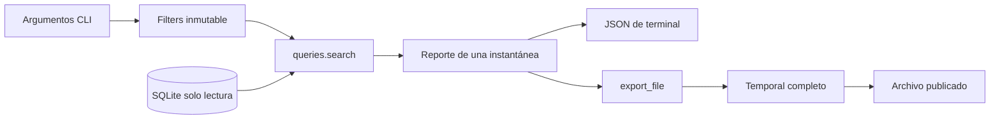

# I3 — convertir la colección en una herramienta utilizable

Aplicación 0.3.0, implementada el 2026-09-26. Este corte completa el MVP técnico: consultar, inspeccionar cambios y conservar una selección. La base real contiene las 19 ofertas obtenidas en I2; I3 no necesita nuevas descargas. Tus ejercicios y conclusiones personales quedan por realizar.

## Probar el recorrido

```powershell
Set-Location C:\Bruze\nicrawl
$nicrawl = '.\.venv\Scripts\nicrawl.exe'
& $nicrawl list --query python
& $nicrawl list --location-text worldwide --limit 5
$results = & $nicrawl list --limit 1 | ConvertFrom-Json
if ($results.jobs.Count -gt 0) { & $nicrawl show $results.jobs[0].job_key }
& $nicrawl changes --run latest
& $nicrawl export --query python --format json --output .\data\python.json
& $nicrawl export --query python --format csv --output .\data\python.csv
```

Si un destino ya existe, elegir otra ruta o pasar --overwrite. Los ejemplos quedan en data, fuera de la entrega/versionado. Una búsqueda puede devolver cero coincidencias legítimas. list limita a 20 por defecto (máximo 200); export selecciona todos salvo --limit explícito. Repetir filtros y límite para comparar conjuntos idénticos.

source_status muestra último intento y última publicación; cada oferta tiene first_seen_at, last_seen_at, last_changed_at y stale. Los instantes no son sinónimos de publicación ni cierre. Leer el [contrato CLI](../docs/CLI.md) antes de inferir significado a partir de nombres.

## Seguir el código



| Punto | Archivo | Pregunta para un breakpoint |
| --- | --- | --- |
| Argumentos | [cli.py](../src/nicrawl/cli.py) | ¿Qué reciben list_command y export_command? |
| Selección | [queries.py](../src/nicrawl/queries.py) | ¿Por qué Filters.matches usa casefold y AND? |
| Identidad y estado | [storage.py](../src/nicrawl/storage.py) | ¿Qué cambia al abrir Repository readonly? |
| Archivo | [exporting.py](../src/nicrawl/exporting.py) | ¿Cuándo aparece el destino? ¿Qué limpia finally? |
| Riesgos | [test_queries_export.py](../tests/test_queries_export.py) | ¿Qué aserción detecta pérdida de datos? |

Desde iOS: Filters se parece a un valor de consulta independiente de una vista; Repository mantiene la conexión, un recurso cuyo ciclo de vida debe cerrarse. El reporte es un snapshot. No hay un observable global que refresque remotamente al abrir una pantalla: collect invoca explícitamente la adquisición. Estas analogías ubican responsabilidades, sin convertir sqlite3 en Core Data.

## Laboratorio 1 — semántica de búsqueda

Ejecutar test_search_casefold_and_literal_substrings_and_order. Predecir por qué STRASSE coincide con Straße, mientras cafe no coincide con Café. query busca cualquiera de tres campos; company y location restringen con AND. El signo % es literal, no comodín SQL.

Agregar personalmente un filtro por tag: primero un caso con dos tags y otra oferta sin tags; después extender Filters y ambos comandos. Explicar por qué no se modifica el adaptador HTTP. Decidir si el tag coincide completo o por subcadena. Este cambio es un ejercicio pendiente, no una capacidad incluida.

## Laboratorio 2 — leer historia sin inventarla

Seguir test_changes_latest_partial_ignores_failure_and_preserves_history: R1 crea, R2 modifica y publica parcialmente, R3 falla. La novedad pertenece a R2; el estado operativo reciente pertenece a R3. Comparar before/after y fields. Consultar R1 sigue mostrando su título original aunque jobs actual haya cambiado.

Explicar qué pasaría si changes hiciera JOIN a jobs y mostrara su título actual como título histórico. Dibujar observaciones e intentos en líneas de tiempo separadas. Una corrida vacía completa puede tener cero novedades y conservar todas las ofertas anteriores.

## Laboratorio 3 — el archivo también es una transacción

Ejecutar los tests de fallo durante _write y de carrera al publicar. Antes, anotar qué archivo debería existir y qué bytes contener. El destino anterior no se abre para escribir: se termina otro archivo y luego se publica. Un exists seguido de replace no protege contra otro proceso que cree el destino entre ambas acciones.

csv_cell cambia la representación CSV, no JobDraft ni SQLite. JSON escapa controles conservando su valor al decodificar. CSV es texto tabular; una planilla puede inferir tipos o reinterpretar valores. Volver a guardar desde otra aplicación no garantiza preservar las protecciones iniciales.

## Laboratorio 4 — medir antes de optimizar

La búsqueda de 10.000 ofertas con descripciones sintéticas de 1.280 caracteres tardó aproximadamente 0,36 s. Se midió apertura, esquema, estado, orden, lectura y filtros; se excluyó arranque CLI y renderizado. Ver [evidencia](../VALIDATION.md).

Pensar dónde crecería el costo con 100.000 ofertas: decodificación JSON, casefold y memoria. Contrastar con un índice persistido y su costo de actualización/migración. No agregar FTS por intuición: fijar carga, semántica y presupuesto. La [decisión](../docs/adr/006-local-queries-exports.md) explica el compromiso.

## Cierre personal

Explicar sin mirar: por qué list no hace HTTP; qué significa latest; límite de pantalla vs selección exportada; qué protege una transacción de lectura; por qué no basta escapar comillas en CSV; qué archivo queda ante una excepción. Registrar una predicción fallida, el test que la corrigió y una modificación propia en la [bitácora](07-workbook.md).

I4 ya agrega otra fuente y un laboratorio externo; seguir [su guía](11-second-source-html-lab.md). I5 y posteriores permanecen pendientes de aprobación. No hacen falta para practicar ni para utilizar este MVP local.
