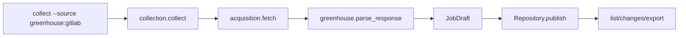
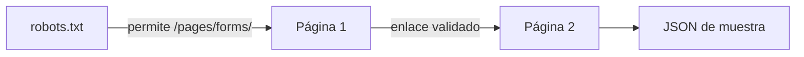

# I4 — dos adaptadores y HTML externo controlado

Aplicación 0.4.0, 2026-09-28. Este corte ofrece dos preguntas distintas: ¿cómo agrego otro proveedor sin reescribir el repositorio? ¿cómo sigo enlaces y extraigo HTML externo sin confundir una muestra con un lote completo?

## Ejecutar

```powershell
Set-Location C:\Bruze\nicrawl
$nicrawl = '.\.venv\Scripts\nicrawl.exe'
& $nicrawl status --source greenhouse:gitlab
& $nicrawl list --source greenhouse:gitlab --query backend --limit 5
& $nicrawl list --source all --limit 5
& $nicrawl changes --source greenhouse:gitlab
& $nicrawl lab-html --pages 2
```

`collect --source greenhouse:gitlab` hace red y consume una oportunidad; `status`, `list` y `changes` leen la base. La primera consulta real ya guardó 200 ofertas de GitLab. El ejercicio HTML hace hasta tres GET acotados (robots y dos páginas) y no guarda filas. El comando volverá a revisar robots en cada ejecución. Ver [CLI](../docs/CLI.md) y [fuentes](../docs/DATA_SOURCES.md).

## Seguir una oferta



Puntos para breakpoints: [collection.py](../src/nicrawl/collection.py) elige endpoint y parser; [acquisition.py](../src/nicrawl/acquisition.py) reserva el intento antes de enviar; [greenhouse.py](../src/nicrawl/sources/greenhouse.py) valida y transforma; [storage.py](../src/nicrawl/storage.py) comprueba que `job.source_id` coincida con el run y publica atómicamente. La clave `greenhouse:gitlab:<id>` separa esta oferta de un ID numérico idéntico en Remotive. La cuota también se separa por `source_id` dentro de la **misma** base. Copiar la base o usar otra rompe esa coordinación.

Greenhouse devuelve HTML escapado en `content`. La transformación aplica `html.unescape` dos veces porque la documentación muestra entidades anidadas, luego Beautiful Soup elimina `script/style/template` y obtiene texto. No se interpreta ese HTML en la terminal. `updated_at` del origen no es `last_seen_at`: el segundo es cuándo nuestra colección observó la oferta. `Remote` en ubicación no basta para afirmar una modalidad universal ni elegibilidad desde Argentina; `work_mode` queda unknown.

## Seguir una página HTML



[html_lab.py](../src/nicrawl/html_lab.py) fija host y ruta. Comprueba robots antes de descargar el HTML, espera dos segundos entre requests al mismo host, acepta solo HTTPS y el parámetro `page_num` esperado. El parser exige tabla, filas completas y claves `(equipo, año)` únicas. Después de dos páginas declara `has_more` si encuentra otro enlace; no afirma haber recolectado todas las temporadas. No escribe en SQLite. Esta separación preserva la semántica del producto.

## Ejercicios para reconstruirlo

1. Leer [test_i4_sources.py](../tests/test_i4_sources.py) y predecir qué falla si `meta.total` no coincide, si dos posts tienen el mismo ID con contenido diferente, si robots excluye `/pages/`, o si la página siguiente apunta a otro host.
2. En una copia de un fixture sintético, quitar `td.wins` de una fila. Seguir `parse_page` hasta el error. Explicar por qué no se descarta silenciosamente esa fila para continuar con las restantes.
3. Dibujar dos runs, uno por fuente, con el mismo ID numérico. Señalar qué columnas y claves evitan mezclarlos. Mostrar por qué `list --source all` puede unirlos sin deduplicar por título.
4. Probar un campo opcional de Greenhouse con un test antes de mapearlo. Decidir si el campo representa dato material, metadato de fuente o inferencia. Justificar si debe cambiar `content_hash`.

El [ADR-007](../docs/adr/007-second-source-html-lab.md) registra las decisiones y sus alternativas. Documentar tus hallazgos en la [bitácora](07-workbook.md). Los ejercicios son personales y quedan pendientes aunque la verificación técnica del corte pase.
