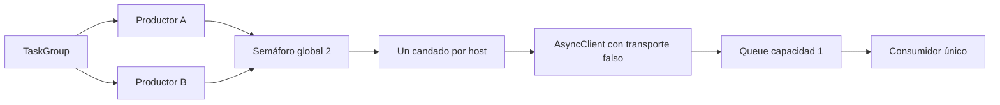

# I5 — medir concurrencia y planificar sin perder las cuotas

Aplicación 0.5.0. El objetivo de aprendizaje es comprobar **qué espera puede solaparse**, dónde aparece la presión de memoria y qué ocurre al cancelar una tarea. El experimento no descarga ofertas reales. Los comandos operativos `plan` y `collect-all` reutilizan la política y el pipeline existentes.

## Ejecutar sin red

```powershell
Set-Location C:\Bruze\nicrawl
$nicrawl = '.\.venv\Scripts\nicrawl.exe'
& $nicrawl plan
& $nicrawl lab-concurrency
& $nicrawl lab-concurrency --delay-ms 100 --records 8 --write-ms 10
```

`plan` lee la base para cada fuente: ready, deferred, disabled o uninitialized. `ready_at` es una **estimación** en UTC; no aparta cuota. `collect` comprueba de nuevo justo antes del envío. No cambiar de base para eludir la política. `lab-concurrency` usa dos hosts ficticios `.example` y un transporte HTTPX sintético; no abre conexiones externas ni modifica SQLite. Cambiar delay y write_ms permite ver cuándo solapar espera ayuda menos porque el escritor domina el tiempo.

Si se decide hacer una recolección real manual de ambas fuentes:

```powershell
& $nicrawl collect-all
```

`collect-all` llama las dos fuentes **una después de otra**. Puede descargar si son elegibles. Informa el run y estado de cada una; sigue a la segunda si la primera devuelve failed/deferred. Código 1 si hay fallo, 3 si hay parcial, 4 si hay diferido sin fallo/parcial, 0 si ambas terminan bien. No usarlo como prueba repetida de rapidez: consume presupuesto real cuando hay oportunidad. El laboratorio es el comando adecuado para repetir experimentos.

## Seguir las tareas



En [concurrency_lab.py](../src/nicrawl/concurrency_lab.py), el transporte ejecuta `await asyncio.sleep`, que cede control al event loop. La petición síncrona anterior usaría bloqueo mientras espera. El semáforo deja como máximo dos peticiones simuladas en vuelo; un candado por host evita paralelismo accidental contra el mismo sitio. Los productores hacen `await queue.put`: si la cola está llena esperan al consumidor, que representa al escritor. Se registra el pico de peticiones, de cola y las veces que apareció backpressure.

El consumidor procesa un elemento a la vez. En el escenario de cancelación, se cancela el productor Remotive a mitad de la espera y Greenhouse concluye. `CancelledError` se registra y **se vuelve a lanzar**; el `TaskGroup` espera el cierre ordenado. Una cancelación del padre también se propaga, sin dejar un cliente abierto. Ver [tests de I5](../tests/test_i5_concurrency.py).

## Qué midió realmente

Cinco rondas en esta máquina, con dos peticiones ficticias de 200 ms, ocho registros por fuente y 10 ms por escritura: mediana secuencial 0,6685 s; concurrente 0,4524 s; mejora 1,48×. El productor concurrente no puede reducir las 16 escrituras serializadas. Cambiar `--write-ms` hacia 100 debería hacer menos importante la espera de red relativa al total; anotar una predicción antes de medir. La salida incluye una tercera ejecución de cancelación, fuera de los dos tiempos comparados.

Este laboratorio no prueba mejora en `collect`: ahí quedan TLS, bytes reales, parsing, transacciones, cuotas y el bloqueo de una sola base. La [decisión de arquitectura](../docs/adr/008-concurrency-experiment.md) explica por qué producción sigue secuencial.

## Ejercicios

1. Cambiar `--delay-ms` entre 50 y 500, mantener `--write-ms` fijo. Predecir ratio y repetir cinco veces; comparar medianas, no una ejecución aislada.
2. Usar en un test dos feeds con el mismo host. El pico global puede llegar a dos con otro host, pero el pico de ese host debe seguir en uno. Explicar qué protege cada límite.
3. Cambiar temporalmente `queue_size=1` por dos en una copia del test. Identificar qué métrica cambia y por qué no aumenta la cantidad final de registros. Evitar una cola sin máximo en una fuente real.
4. Quitar temporalmente `raise` del bloque que captura `CancelledError`. Observar qué prueba deja de demostrar propagación y explicar por qué `TaskGroup` no debe perder la señal de cancelación. Restaurar el código después del ejercicio.
5. Seguir [planning.py](../src/nicrawl/planning.py): construir cuatro intentos de una fuente en 24 h, luego un `next_allowed_at` más lejano. Predecir qué restricción fija `ready_at`. Comparar con el `gate` real bajo [storage.py](../src/nicrawl/storage.py).

Desde experiencia iOS, `TaskGroup` recuerda a concurrencia estructurada: los hijos pertenecen a un alcance. `asyncio.Queue` exige pensar en el consumidor y su capacidad, parecido a limitar trabajo pendiente antes de tocar persistencia. La analogía no implica que SQLite sea async; nicrawl mantiene un escritor real controlado por bloqueo.

No se instaló un scheduler. `plan` y `collect-all` permiten evaluar una rutina manual antes de decidir horario, avisos y comportamiento cuando Windows duerme o se reinicia. Registrar resultados e hipótesis en la [bitácora](07-workbook.md). Los ejercicios personales siguen pendientes.
