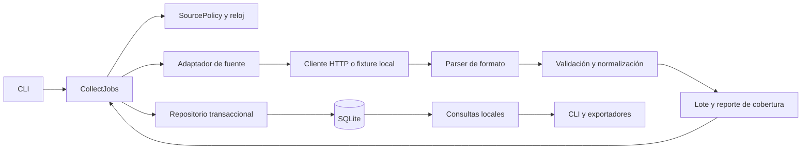

# Arquitectura propuesta

Estado: arquitectura implementada I0–I10, actualizada el 2026-09-30. I8 agrega `agent_tools.py`, `mcp_server.py` y `agent_demo.py`; [ADR-011](adr/011-agent-tools-mcp.md). I7 agrega `server.py` y `ui/` como adaptadores de presentación; ver [ADR-010](adr/010-local-ui-api.md). I6 agrega `personal.py`, esquema 2 y ranking calculado en lectura; ver [ADR-009](adr/009-personal-state-ranking.md). I5 añade plan read-only, collect-all secuencial y un laboratorio asyncio aislado; ver [ADR-008](adr/008-concurrency-experiment.md). I4 agrega Greenhouse/GitLab y el laboratorio HTML independiente; ver [ADR-007](adr/007-second-source-html-lab.md). I2 agrega `collection.py`, `acquisition.py`, `locking.py`, `storage.py` y `sources/remotive.py`. Reloj y transporte se inyectan por parámetros. I3 agrega queries.py y exporting.py para consultas y exportación; las lecturas usan una instantánea transaccional. Arquitectura de puertos y adaptadores aplicada a fronteras concretas, sin microservicios.

## Recorrido de una recolección



El diagrama muestra ejecución y datos. Las dependencias de código apuntan hacia modelos y contratos: el dominio no importa Typer, HTTPX, Beautiful Soup ni SQLite. La composición de objetos vive en la entrada del programa.

## Responsabilidades

| Pieza | Conoce | No decide |
| --- | --- | --- |
| CLI | Argumentos, presentación, códigos de salida | Selectores HTML o reglas de identidad |
| CollectJobs | Política, reloj, fuente, repositorio, resultado del run | Estructura de JSON del proveedor |
| SourceAdapter | Origen, formato y alcance exactos | Cómo renderizar una tabla |
| Fetcher | GET, límites, bytes, estado HTTP | Si un salario es anual |
| Parser | HTML/JSON hacia candidatos | Escrituras de base o reintentos |
| Normalizer | Invariantes y candidatos hacia JobDraft | Descargar páginas |
| Repository | Transacción, claves únicas y consultas | Hacer HTTP |
| Exporter | Representación estable de resultados | Refrescar datos |

Contratos conceptuales: `SourceAdapter.collect(policy) -> SourceBatch`, `JobRepository.publish(run, batch) -> ChangeSummary` y `Clock.now()`. `SourceBatch` incluye ofertas válidas, rechazos, cantidades, ámbito y cobertura. Son diseños, no interfaces implementadas.

Usar funciones puras para parsing y normalización donde alcance. Introducir `Protocol` cuando haya dos implementaciones concretas o un límite que se deba sustituir en pruebas; no crear interfaces para cada función. Un fake de fuente y un repositorio temporal deben poder reemplazar red y disco sin modificar la CLI.

## Flujo detallado y atomicidad

1. Adquirir bloqueo exclusivo de recolección de la base. Las lecturas locales siguen disponibles.
2. Crear run `running`; verificar fuente habilitada, presupuesto y configuración. Registrar intentos de red de forma durable antes de enviarlos para que un crash no reinicie la cuota.
3. Obtener el documento completo en memoria, dentro de los límites de tamaño. No mantener una transacción SQL mientras se espera red.
4. Verificar envoltura y marcadores del formato; extraer candidatos; validar cada candidato. Error estructural invalida el lote completo. Un registro aislado inválido puede producir un lote parcial.
5. Abrir transacción corta para publicar ofertas válidas, cambios, estadísticas y estado final del run. Si falla, rollback; ninguna oferta queda actualizada a medias.
6. Si no se publicaron datos por un fallo previo, registrar el fallo por separado. Si la base está inaccesible, informar por stderr y salida 1 sin prometer un registro durable.
7. Liberar recursos y bloqueo aun ante interrupción.

Un run parcial puede publicar ofertas válidas pero nunca establecer ausencias. No se hace commit de una página intermedia si falló otra página: la paginación truncada invalida la adquisición del lote en v0.1. Esta regla permite conservar sencillez y evidencia clara de cobertura.

## Modelos y propiedad del dato

El DTO refleja el proveedor; el `JobDraft` ya expresa reglas de nicrawl; `JobRecord` añade identidad y tiempos de persistencia. Pydantic valida entradas en los adaptadores; dataclasses y enums mantienen el dominio pequeño. No se duplica un modelo sin una transformación o responsabilidad real que lo justifique.

SQLite será la fuente de consulta después de publicar una corrida. `collect` entrega un resumen; no mantiene una segunda lista global en memoria para búsquedas posteriores. [DATA_MODEL](DATA_MODEL.md) define los invariantes.

## Anotaciones y ranking

`personal_state` es una tabla aparte referida por `job_key`. La migración 1→2 no reescribe `jobs`; las notas no afectan huellas ni historial de proveedor. `score_job` es puro; la consulta de ranking lee una instantánea, filtra, puntúa y ordena. `show` agrega la anotación local. La CLI recibe preferencias por invocación, sin perfil persistido ni red. [ADR-009](adr/009-personal-state-ranking.md).

## Próxima frontera de presentación, aún propuesta

I7 implementa una UI local que consume la [API HTTP](API.md). UI, API y CLI comparten casos de uso Python de consulta, ranking y anotación; ninguna presentación posee reglas de negocio ni accede directamente a tablas. CLI y API siguen operables desde PowerShell. `serve` inicia el servidor en loopback y se termina con Ctrl+C. I8 reutiliza operaciones de lectura acotadas mediante herramientas MCP, con permisos propios para cualquier escritura o adquisición. Ver [roadmap](ROADMAP.md) y [extensiones](EXTENSIONS_AI.md).

## Concurrencia

I0–I3 usan ejecución secuencial. Un `httpx.Client` se reutiliza durante la corrida y se cierra al salir. Ser moderno en Python no exige `async` para dos consultas diarias. Esto permite observar errores y transacciones antes de añadir cancelación concurrente.

I5 estudió `asyncio.TaskGroup`, límites por host y cola acotada mediante transporte sintético. El pipeline real permanece secuencial; una migración requeriría medirla y diseñar un escritor único. Cambiar a async requerirá `AsyncClient` y gestión explícita del escritor SQLite; poner una función bloqueante dentro de `async def` no la vuelve cooperativa. La regla de publicación atómica y el contrato de errores deben mantenerse. [ADR-004](adr/004-execution-policy.md).

## Organización objetivo; I2 conserva módulos planos pequeños

```text
src/nicrawl/
  cli.py                 # comandos y composición inicial
  application/           # collect y consultas
  domain/                # modelos, identidad y políticas puras
  sources/               # demo_html y remotive
  infrastructure/        # HTTP, sqlite, reloj y bloqueo
  exporters/             # JSON y CSV
tests/
  fixtures/              # entradas sintéticas con procedencia
  unit/
  integration/
```

No se necesita un contenedor de DI. Los constructores reciben dependencias. Los módulos se crean cuando exista comportamiento que alojar; este árbol no exige carpetas vacías desde I0.

## Puente con arquitectura iOS

La CLI cumple el papel de un adaptador de presentación; los casos de uso y repositorios resultarán familiares. Una corrida reemplaza al ciclo de interacción de pantalla como unidad de trabajo. El problema dominante aquí es consistencia de datos entre ejecuciones, no estado de navegación. `Protocol` sirve para contratos estructurales de tipos; no debe asumirse que tiene idénticas garantías que un protocolo Swift. [Recorrido comparativo](../LearnDocs/03-python-from-ios.md).

## I9: perfiles y evaluación

`saved_searches.py` valida/persiste configuración junto a la base, sin migrarla, y reutiliza consultas/ranking. `saved_cli.py` y rutas `/api/searches` son adaptadores. `evaluation.py` obtiene backup consistente temporal, proyecta evidencia sin notas y calcula métricas a partir de etiquetas independientes. Filtro title_query compartido entre CLI, API y MCP. [ADR-012](adr/012-saved-searches-evaluation.md).

## I10: candidaturas

`applications.py` contiene contratos, normalización de identidad y transacciones del almacén personal `<base>.applications.sqlite3`. `application_cli.py` y API/UI son adaptadores. La colección se lee al vincular una oferta y no se modifica; una referencia manual funciona sin colección. Revisiones y eventos se confirman juntos. [ADR-013](adr/013-application-tracking.md).
